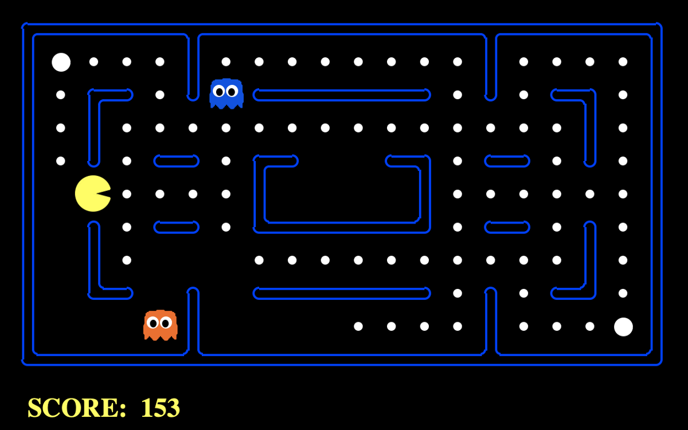

# pacman_AI_Rust

An ongoing pacman project with AI learning on AWS written in Rust

## To-do List
- [ ] build Pac-man in Rust locally
- [ ] build Pac-man in AWS
- [ ] Using Algorithm to allow the agent to paly Pac-man automatically
- [ ] Train an AI to play Pac-man
  
## References

* [rust-cli-template](https://github.com/kbknapp/rust-cli-template)
* [The Rust Programming Language](https://doc.rust-lang.org/book/)
